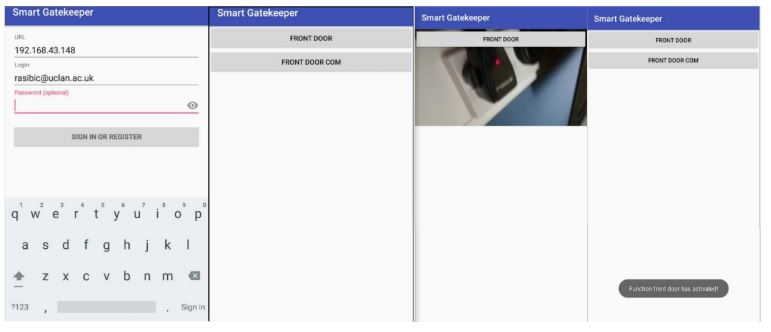

# Gatekeeper client side

This project is an IoT based application with the aim of controlling a door strike and camera with an Android smartphone.
The app allows you to log in to a server to unlock the door or view the camera feed.

You can find the server side application under: [Gatekeeper-Flask](https://github.com/RidSib/Gatekeeper-Flask)

## Application screenshots

